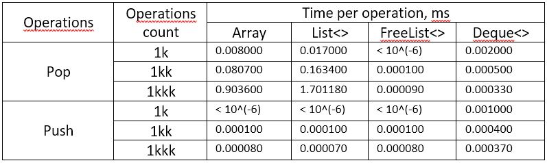

# FastPool
Library of scripts to help facilitate the creation of a pool of objects. Uses efficient data structures at its core.

[](https://github.com/RodionLodza/FastPool/blob/master/LICENSE)
[](https://github.com/RodionLodza/FastPool/watchers)
[](https://github.com/RodionLodza/FastPool/stargazers)
<br />
<< [Advantages](#advantages-of-the-library) | [How to use](#how-to-use-this-library) | [Install](#how-to-install) | [Download](https://github.com/RodionLodza/FastPool/raw/master/FastPool.unitypackage) >>
<br />
<br />

## Advantages of the library
This library will help you quickly and efficiently develop object pools in your projects. The library is written very simply and intuitively (implements the classic design pattern - the object pool). In addition, this library uses an efficient data structure - [FreeList](https://en.wikipedia.org/wiki/Free_list).

> After a ***series of tests*** of different data structures (Array, List, Queue, Stack, ConcurrentBag and FreeList), the most effective data structure at the core of this library was ***FreeList***. The time required for basic operations is shown below.



> Thus, FreeList is thousands of times ***more efficient*** than familiar data structures.

<br />

## How to use this library?
1. ***First***, your pool object must realise the `IPoolable` interface.

```c#
using UnityEngine;
using FastPool;

public class SomePoolObject : MonoBehaviour, IPoolable
{
    public IPoolable NextInactiveObject { get; set; }

    public void ResetStateObject()
    {
        // some action for reset state of pool object
    }
}
```
2. ***Secondly***, you need to realise an object pool manager script (for example, EnemiesController, which will control the logic of enemies and have objects of enemies).

```c#
using UnityEngine;
using FastPool;

public class SomePoolManager : MonoBehaviour
{
    [SerializeField] private SomePoolObject poolObjectPrefab;
    [SerializeField] private int objectsCount;

    private PoolManager<SomePoolObject> poolManager;

    private void Start()
    {
        Initialize();
    }

    private void Initialize()
    {
        poolManager = new PoolManager<SomePoolObject>(objectsCount, ObjectGenerator);
    }

    private SomePoolObject ObjectGenerator()
    {
        return Instantiate(poolObjectPrefab);
    }

    public void PopObjectsTest()
    {
        poolManager.Pop();
    }

    public void PushObjectsTest(SomePoolObject unnecessaryPoolObject)
    {
        poolManager.Push(unnecessaryPoolObject);
    }
}
```
3. ***Done!*** Now you can focus on other tasks in your project.
<br />

## How to install?
1. `Download SimpleLocalization.unitypackage` and using UnityPackageManager.
2. The Unity Package Manager (UPM) is a new method to manage external packages. It keeps package contents separate from your main project files.

Modify your project's Packages/manifest.json file adding this line:
```"com.lodza.fastpool": "https://github.com/RodionLodza/FastPool.git#package-branch"```

To access classes inside of this package you will need to add a reference to com.lodza.fastpool.asmdef to your project's assembly definition file.

## License
* [MIT](https://github.com/RodionLodza/FastPool/blob/master/LICENSE)
